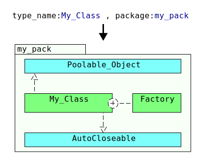
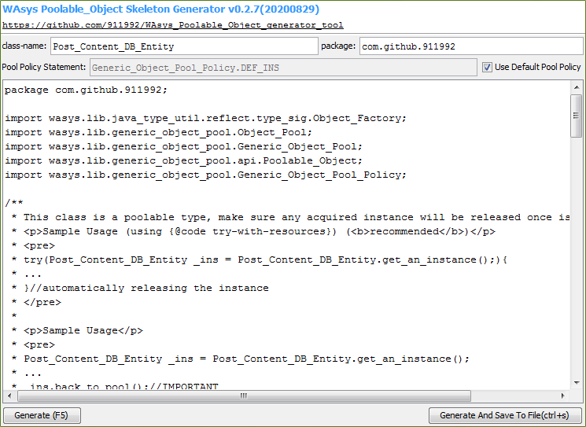
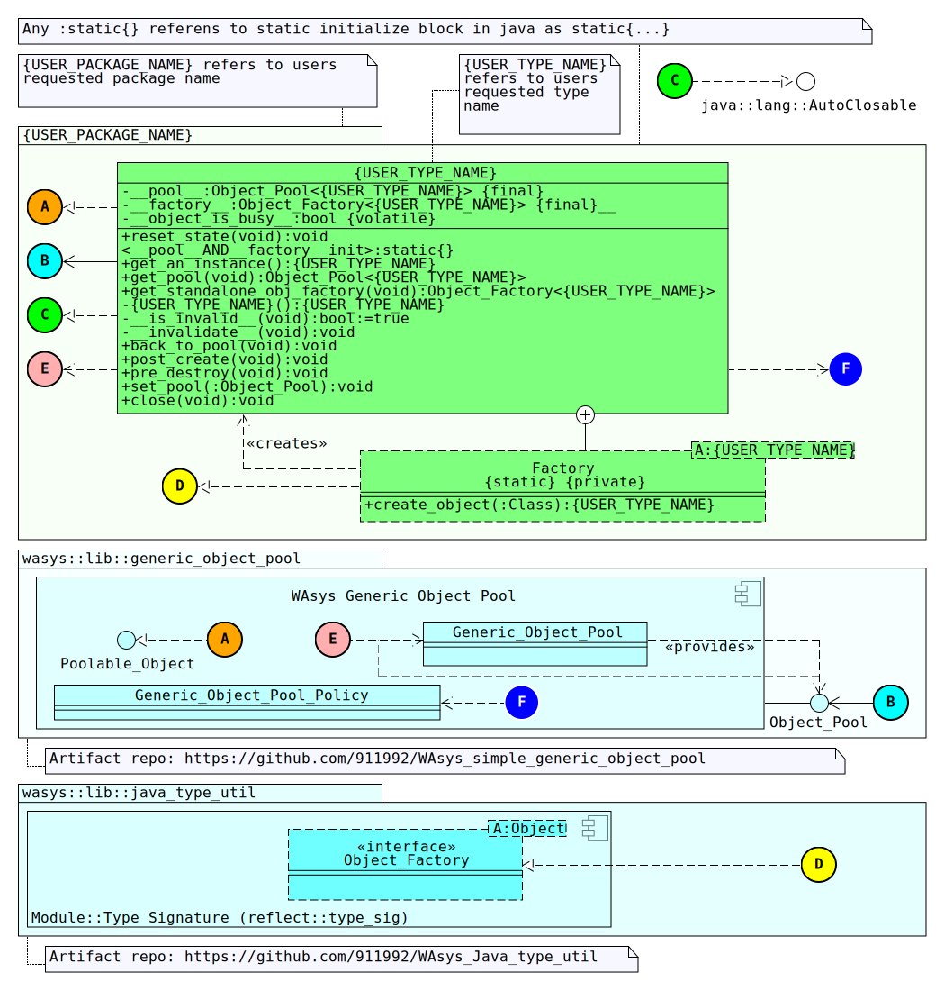

# WAsys_Poolable_Object_generator_tool
Simple tool for making skeleton of `Poolable_Object` [WAsys_simple_generic_object_pool](https://github.com/911992/WAsys_simple_generic_object_pool) entities.

**WAsys `Poolable_Object` Skeleton Generator Tool** is a very simple `GUI/CLI` tool that generates a `Poolable_Object` based on user's input.  

  
*diagram 0: social media vector*

## Revision History
Latest: v0.1.1 (Jun 26, 2020)  

Please refer to [release_note.md](./release_note.md) file  

## Requirments
0. Java 1.8  
1. A desktop shell (if graphical interface is desired)

## How To Build
You could build the project using either Maven or Ant, or simply using the latest release from the repository.  

### Using Ant
0. Clone the repository  using `git -clone https://github.com/911992/WAsys_Poolable_Object_generator_tool.git`
1. Build the project using ant as `ant -v clean jar`
2. Artifact under `dist` folder

### Using Maven
0. Clone the repository  using `git -clone https://github.com/911992/WAsys_Poolable_Object_generator_tool.git`
1. Build the project using maven as `mvn clean package`
2. Artifact under `target` folder

## Usage 
Project has two `main` classes as `Main_GUI`, and `Main_CLI`. Once project is built, simply run the jar file as `java -jar <<artifact_name>>`.  
By default it shows the help(`-h`) command, something like following.
```
$ java -jar ./dist/WAsys_poolable_entity_tool.jar
Error! zero-length input argument is not expected!
WAsys Poolable_Object Skeleton Generator v0.1(20200625)
https://github.com/911992/WAsys_Poolable_Object_generator_tool
-----------
Command Lines:
-h                                      :Shows this help(ignore other cmds)
-fancy                                  :Runs the tool in GUI mode
-class <<entity_type_name>>             :Tells the type's name(could be skipped)
-package <<entity_package_name>>        :Tells the type's package name(could be skipped)
-pol <<pool_policy_stmt>>               :Tells the statement/syntax for setting the pool policy variable(could be skipped)
-save                                   :Saves the output to a .java file to current path(required -class, ignores -fout)
-fout <<file_out>>                      :Specifies the file as output(if absent, STDOUT will be used)
```

### Sample Usage
Considering following scenarios, for generating `Poolable_Object` entities.  

#### Scenario 0
Class name: `My_Class`  
Package : none  
Pool Policy Statement: default  
Output: `STDOUT` (default)  
**Command:** `java -jar <<artifact_name>> -class My_Class`

#### Scenario 1
Class name: `Good_Type`  
Package : `com.github.911992`  
Pool Policy Statement: default  
Output: File, as `sample_output.txt`  
**Command:** `java -jar <<artifact_name>> -class Good_Type -package com.github.911992 -fout sample_output.txt`

#### Scenario 2
Class name: `Guru_Entity`  
Package : `com.github.911992`  
Pool Policy Statement: `Meta_CLass.get_default_pool_policy()`  
Output: to related `.java` class  
**Command:** `java -jar <<artifact_name>> -class Guru_Entity -package com.github.911992 -save` *Result will be saved to `Guru_Entity.java` file*

### Graphical Interface
For running the graphical interface, run the artifact using `-fancy` command. It looks osmething liek following.

  
*Figure 0: graphical interface*

## Generated Entity
Generated entity is about a `Poolable_Object` & `AutoClosable` class, that has the related `Object_Pool` as a `static` field.  
The `Object_Factory` class also lands as `static` and inner class of the enruty type. That cretaes instance of the entity using its **private** constructor.  

Entity tracks the object pool state using a private `boolean` variable, so as far as entity is used in right way, there will be no inconsistency and/or UB.

  
*diagram 1: generated class/artifact class diagram*

## Using A Generated Entity
This is highly recommended to use a `try-with-resources` block working with generated entity by this tool. As the target entity is also as `AutoClosable`, and would return the entuty to the related ppol when no more is needed. Considering
```java
try(Batman_Poolable_Entity _ins = Batman_Poolable_Entity.get_an_instance();){
    /*using _ins*/
}//automatically releasing the instance
```
*code snippet 0: using a generated `Poolable_Object` & `AutoClosable` entity in `try-with-resources` block*

But for situation where using a `try-with_resources` is not applicable, maybe like a http session, queeded message, etc... So this will be user's duty to release the instance once it's nore more needed, and could be recycled somewhere else. Considering
```java
Joker_The_Better_Entity _ins = Joker_The_Better_Entity.get_an_instance();
/*... using _ins*/
/*...*/
_ins.back_to_pool();//IMPORTANT
```
*code snippet 1: using a generated `Poolable_Object` & `AutoClosable` entity, manually releasing*

Please mind to **not forget** to **release** the instance once it's no more needed, otherwise inconsistency and/or UB may happen.

## Meta
You may please check the related [WAsys_simple_generic_object_pool](https://github.com/911992/WAsys_simple_generic_object_pool) repo/lib that this tool is supposed to be a helper for.

### Icon Of Graphical Interface
Icon image of grphical interface is a windows 9x icon known as `app-wizard-file`(or something like that).  
  
*Figure 1: graphical interface icon*
